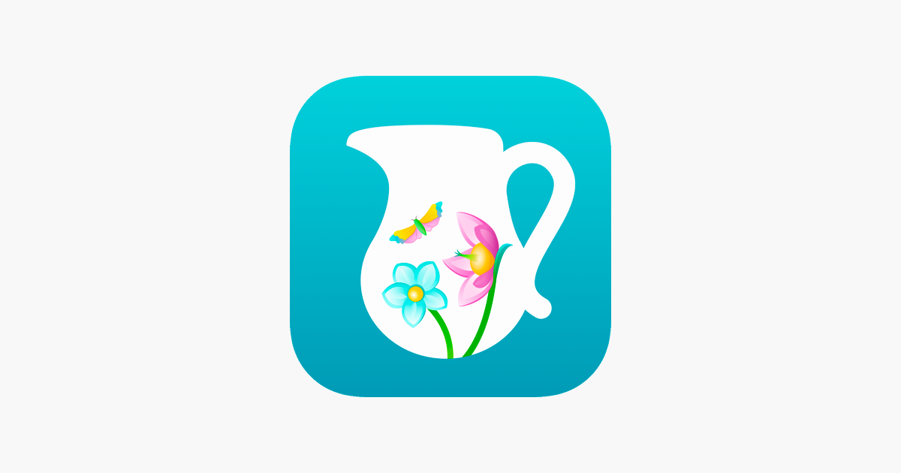

<h1 align="center">Привет, я Эльдар 👋</h1>
<h3 align="center">QA Engineer | Специалист по ручному и автоматизированному тестированию</h3>

### Обо мне
Я QA Engineer с опытом в ручном и автоматизированном тестировании. Специализируюсь на:
- Комплексном тестировании (функциональное, API, UI)
- Разработке тестовой документации (чек-листы, тест-кейсы, баг-репорты)
- Автоматизации тестирования на Java

### Образование
**Яндекс Практикум** | Инженер по тестированию: от новичка до автоматизатора (сентябрь 2024 - июнь 2025)
- Освоил полный цикл тестирования ПО от анализа требований до автоматизации
- Получил практический опыт в:
  - Ручном тестировании веб и мобильных приложений
  - Работе с API (Postman, Swagger, Charles)
  - Написании автотестов на Java (JUnit, RestAssured)
  - SQL-запросах (PostgreSQL)
  - Использовании DevTools для диагностики

### Технологии и инструменты

  
  
  
  
  
  
  
  
  
  
  
  

### Портфолио проектов
- [Portfolio GitHub](https://github.com/eddylasvegas/eddylasvegas.github.io) - сборник учебных и практических проектов
  - Ручное тестирование (чек-листы, тест-кейсы, баг-репорты)
  - Автоматизация на Java (UI, API, Unit-тесты)
  - Примеры SQL-запросов
 
### Диплом

### Контакты

